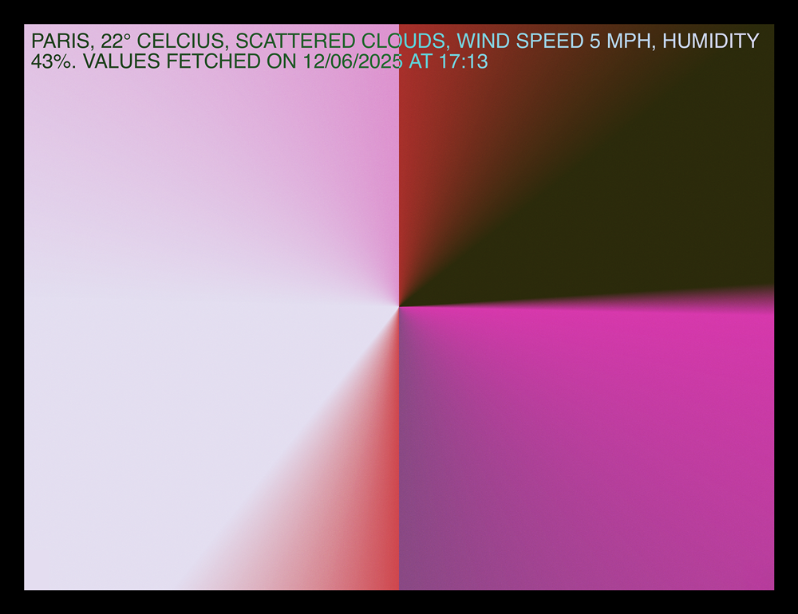

# Weather Composition



A browser-based generative composition driven by live weather data, updated on demand using a ZIP code.

## Prerequisites

- [Node.js](https://nodejs.org) or [Docker](https://www.docker.com)
- An [OpenWeather API key](https://openweathermap.org/api)

## Setup

Copy `.env-example` to `.env` and fill in your API key:

```
cp .env-example .env
```

## Run

**With Node**

```
npm install
npm run dev
```

**With Docker**

```
docker-compose up
```

Then open `http://localhost:5173/weather-comp`.
